

# Sokatoa

For my **Portfolio Project 2** on **Code Institute's 5 Project Course** I have created this fun and informational website focused on teaching student's some foundational trigonometic principles. The site includes useful notes and quizes to reinforce the student's learning

Link to deployed [site](https://cravsi.github.io/sokatoa/).

<figure>
    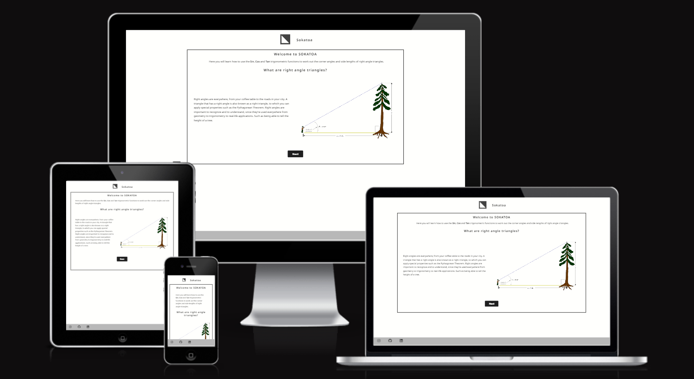
</figure>

## Table of Contents
- [Sokatoa](#sokatoa)
  * [Table of Contents](#table-of-contents)
  * [Project Goals](#project-goals)
    + [User Goals](#user-goals)
    + [Site Owner Goals](#site-owner-goals)
  * [User Experience](#user-experience)
    + [Target Audience](#target-audience)
    + [User Requirements and Expectations](#user-requirements-and-expectations)
    + [User Stories](#user-stories)
  * [Design](#design)
    + [Design Choice](#design-choice)
    + [Colour Palette](#colour-palette)
    + [Fonts](#fonts)
    + [Structure](#structure)
    + [Wireframes](#wireframes)
  * [Technologies](#technologies)
    + [Langauges](#langauges)
    + [Frameworks & Tools](#frameworks---tools)
  * [Features](#features)
    + [Logo and Navigation Bar](#logo-and-navigation-bar)
    + [Footer](#footer)
    + [Hero-Image](#hero-image)
    + [Blurb](#blurb)
    + [Performances](#performances)
    + [Functions](#functions)
    + [Player Information](#player-information)
    + [Contact Form](#contact-form)
    + [Gallery](#gallery)
  * [Testing](#testing)
    + [HTML Validation](#html-validation)
    + [CSS Validation](#css-validation)
    + [Accessibility](#accessibility)
    + [Performance](#performance)
    + [Device Testing](#device-testing)
    + [Browser Compatibility](#browser-compatibility)
    + [Testing User Stories](#testing-user-stories)
  * [Bugs](#bugs)
  * [Deployment](#deployment)
    + [Site Deployment](#site-deployment)
    + [Version Control](#version-control)
  * [Credits](#credits)
## Project Goals
### User Goals
- Learn what trigonometric functions are.
- Learn how to apply the work in maths problems.
- Memorise the three main trig functions with a simple memnomic device.
 

### Site Owner Goals
- Teach site users about trig functions and how to use them
- Ensure site users remember the different functions after they leave the site.
 

## User Experience

### Target Audience
- Those learning the basics of trigonometry
- Those studying for junior cycle maths exams.
- People looking for a simple way to memorise the trig functions.
 

### User Requirements and Expectations
- A simple and intuitive site design.
- A short descriptive section to teach the basics of trigonometric functions.
- Fun and easy game to help reinforce what they have just learnt.
- A functional site that can scale to all screen sizes.
- Accessibilty
- A means of leaving feedback.
 

### User Stories

#### First Time User
1. As a first-time user, I want to know I am on the correct site.
2. As a first-time user, I want to know what the purpose of the site is. 
 

#### User
3. As a user, I want to learn the basics of trigonometric functions.
4. As a user, I want to test my knowledge of trigonometric functions.
5. As a user, I want to see how many correct/incorrect questions I've scored.
6. As a user, I want to provide feedback to the site. 
 

#### Site Owner
7. As the site owner, I want users to be able to find me on social media.
 

## Design

### Design Choice
This webpage has been designed to be visually interesting and provide the readers the information required for them to feel confident in their understanding of trigonometric functions.
 

### Colour Palette
The chosen colour palette was picked to be simple to emphasise the content with more vibrant colours to indicate incorrect and correct answers in the quiz.
 
<figure>
    
    <figcaption>The colour palette used for the website</figcaption>
</figure>
 

### Fonts
The *Noto Sans* font was used for headings and text body.
 

### Structure

 
The site is constructed to be as user-friendly as possible. Upon arriving on the site the user is given a brief introduction to the site and its purpose before the user navigates to the next page. The site is spread across 4 seperate sections on a single html page:

- On the index.html page:
    - A landing and introductory section.
    - one section where to user can learn basic trigonometry.
    - one secion with a quiz.
    - one section with the quiz results.
- A contact form.
- A 404 page.
 

### Wireframes

 <b>Landing screen</b> 

    <figure>
        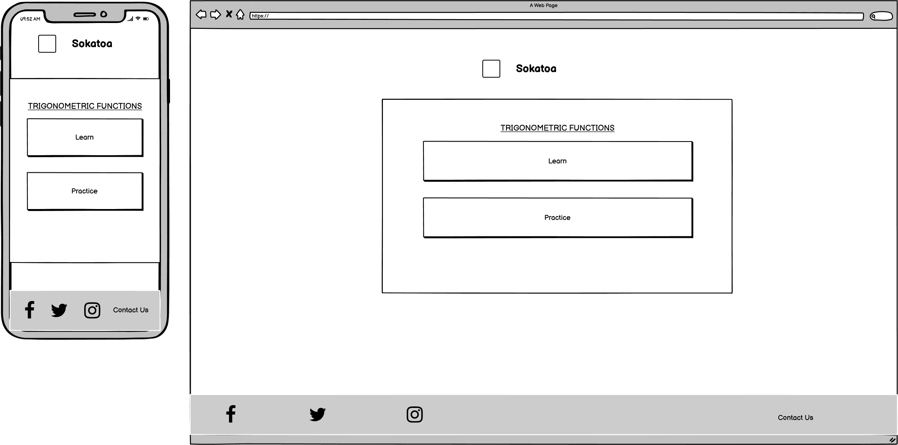
        <figcaption>A wireframe for the landing screen on mobile & browser</figcaption>
    </figure>

 <b>Learning screen</b> 

    <figure>
        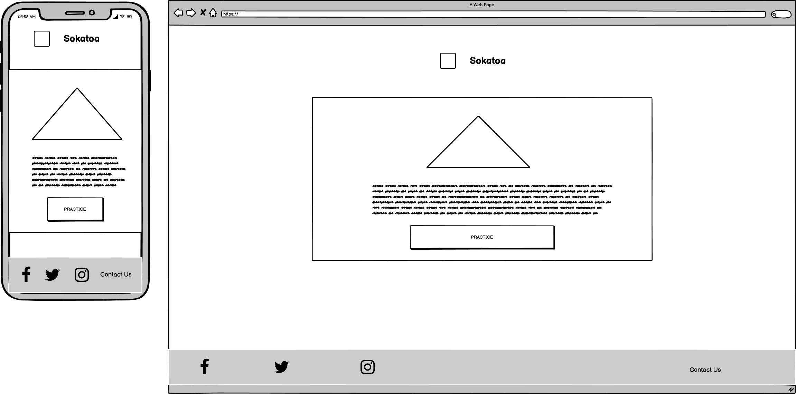
        <figcaption>A wireframe for the learning screen on mobile & browser</figcaption>
    </figure>

 <b>Practice screen</b> 

    <figure>
        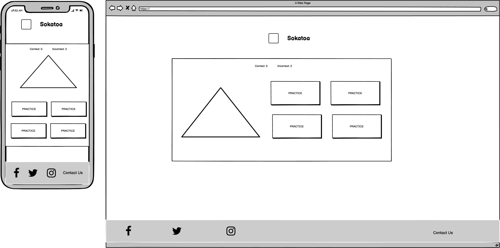
        <figcaption>A wireframe for the practice screen on mobile & browser</figcaption>
    </figure>

 <b>Review screen</b> 

    <figure>
        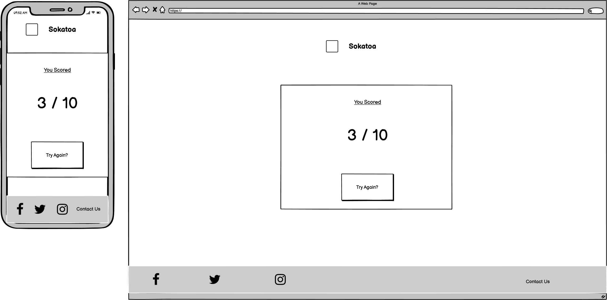
        <figcaption>A wireframe for the review screen on mobile & browser</figcaption>
    </figure>

 <b>Contact form screen</b> 

    <figure>
        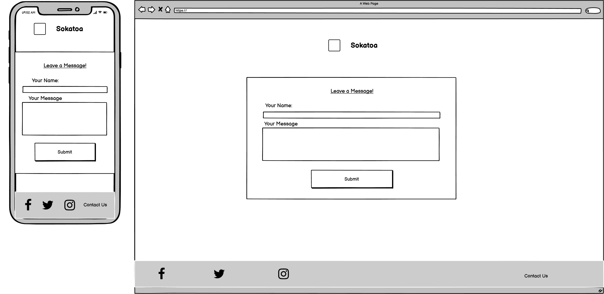
        <figcaption>A wireframe for the contact form page on mobile & browser</figcaption>
    </figure>

 <b>Form confirmation screen</b> 

    <figure>
        
        <figcaption>A wireframe for the form confirmation screen on mobile & browser</figcaption>
    </figure>

 

## Technologies

### Langauges
 - CSS
 - HTML
 - JavaScript
  

### Frameworks & Tools
- [Git](https://git-scm.com/) 
- [GitHub](https://github.com/Cravsi/)
- [GitPod](https://www.gitpod.io/)
- [Balsamiq](https://balsamiq.com/)
- [Google Fonts](https://fonts.google.com/)
- [Pexels](https://www.pexels.com/)
- [TinyPNG](https://tinypng.com/)
- [Convertio](https://convertio.co/jpg-webp/)
 

## Features
This website consists of 1 page, with 4 sections:
 

### Header
 - The logo and name are displayed to confirm the user is on the correct site.
<figure>
    
</figure>

### Footer
- Social Media Links
<figure>
    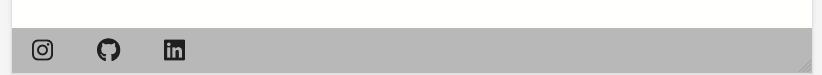
</figure>

### Landing Section
- Introduces the user to the site and basic trig
<figure>
    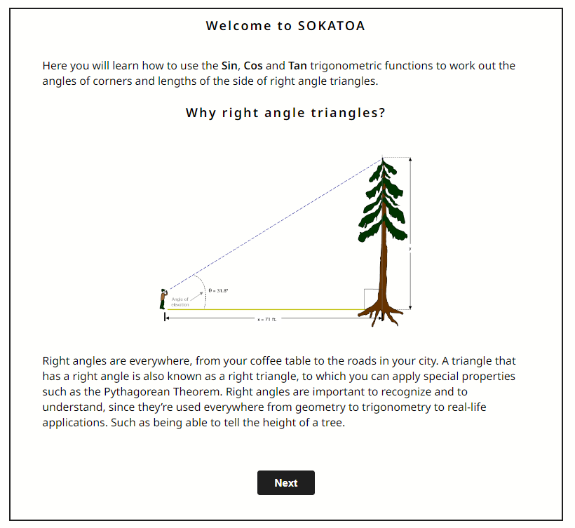
</figure>

### Learn Section
- Provides some basic information to teach the user the basic of triginometric functions
<figure>
    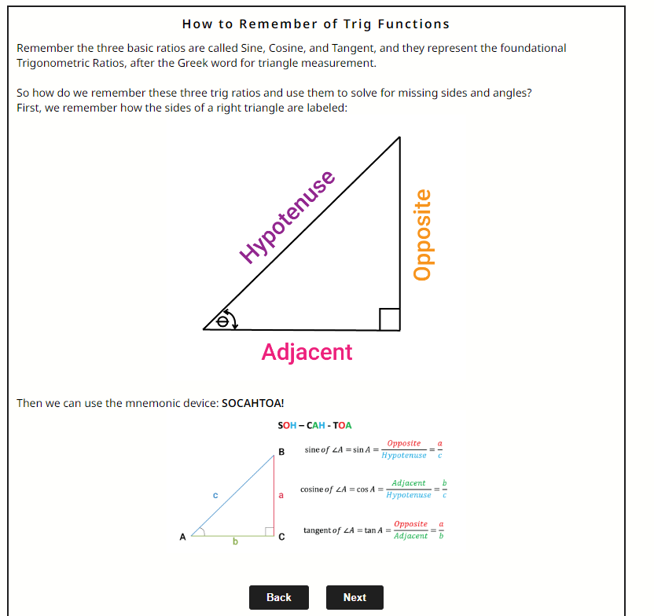
</figure>

### Initial Quiz Section
- The format of the quiz section when the user first lands on the quiz section. 
<figure>
    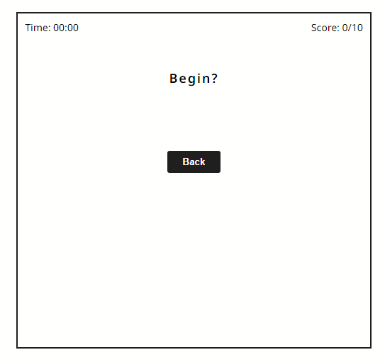
</figure>

### Intermediate Quiz Section
- The format of the quiz section when the user begins the quiz 
<figure>
    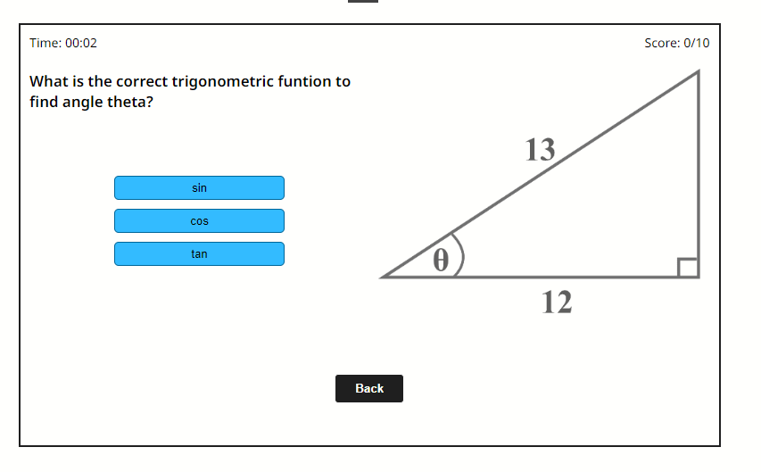
</figure>

### Final Quiz Section
- The format of the quiz section when the user completes the quiz 
<figure>
    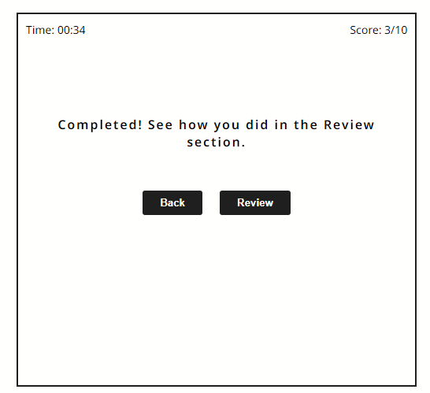
</figure>

### Final Quiz Section
- The format of the quiz section when the user completes the quiz 
<figure>
    
</figure>

### Review Section
- The review screen where the user can review the results of the quiz.
<figure>
    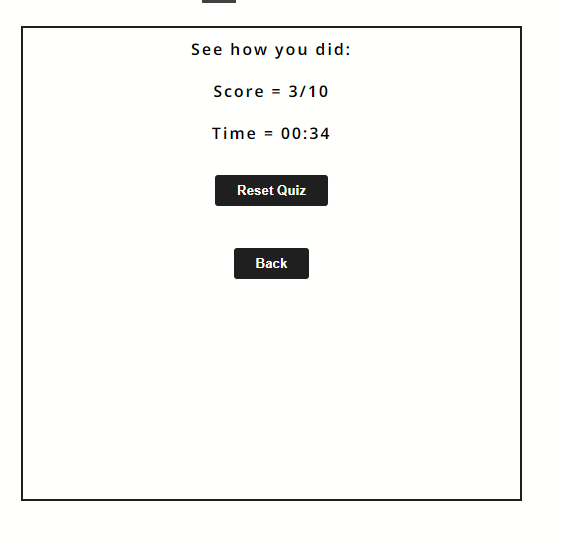
</figure>

### Future Features
 - An interactive right angle triangle to demostrate the effects changing the triangle properties has.
 - An introduction to the unit circle.
 - A section and quiz where the user can learn about wave functions.
 

## Testing
### HTML Validation
The W3C validation service was used to validate the html of the webpage. No errors were detected.

HTML Validation

    <figure>
        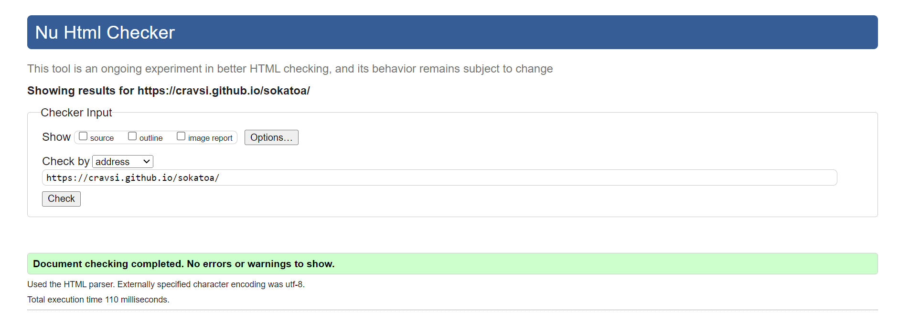
    </figure>

 

### CSS Validation
The W3C Jigsaw CSS validation service is used to validate the sites CSS styling.

CSS Validation

    <figure>
        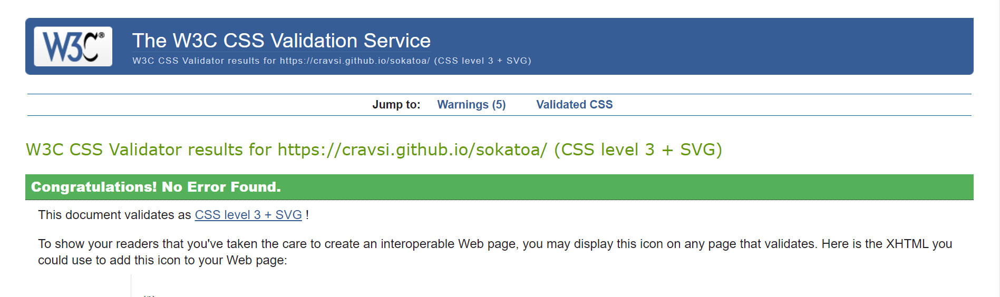
    </figure>

 

### Accessibility
The WAVE WebAIM web accessibility evaluation tool is used to ensure the site has no accesibility or contrast errors.

Accessibility

    <figure>
        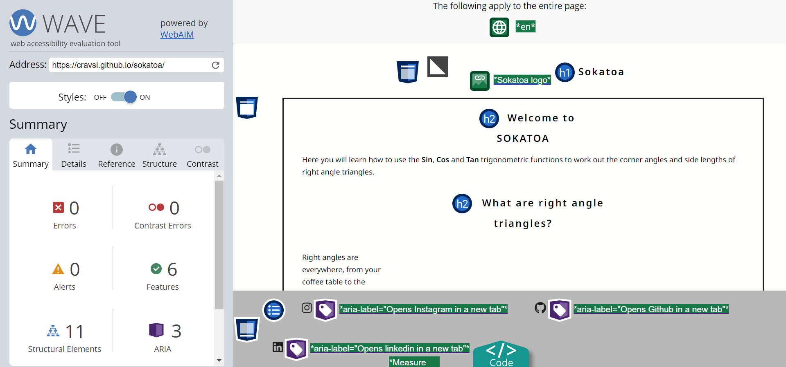
    </figure>

 

### Performance
Google Lighthouse, found in Google Chrome Dev tools was used to test the performance of the site.

Lighthouse Desktop Performance

    <figure>
        
    </figure>

Lighthouse Mobile Performance

    <figure>
        
    </figure>

 

### Local Testing
- Header & Logo
    - Logo and site title remain clearly visible down to a screen width of 200px.
    - Logo link to reload page functions as expected.
- Landing Section
    - Landing section scaling remains functional down to a minimum screen width of 190px.
    - Images and text are clearly seperated and legible at all screen widths.
    - Navigational button works as expected.
- Learn Section 
    - Landing section scaling remains functional down to a minimum screen width of 230px.
    - Images and text are clearly seperated and legible at all screen widths.
    - Navigational buttons works as expected.
- Quiz Section
    - Initial quiz section scaling remains functional down to a minimum screen width of 200px.
    - During the quiz; quiz section scaling remains functional down to a minimum screen width of 230px.
    - After the quiz; quiz section scaling remains functional down to a minimum screen width of 230px.
    - Timer works as expected - Begins when the 'begin' button clicked, stopped when the final question is answered.
    - Score keeper works as expected.
    - Option selection buttons work as expected.
    - Next question button and question resetting works as expected.
    - Review button becoming available upon completion of the quiz works as expected.
- Review Section
    - Review section scaling remains functional down to a minimum screen width of 180px.
    - Score and Time display works as expected.
    - Reset quiz button works as expected.
- Footer
    - Footer scaling remains functional down to a minimum screen-width of 180px.
    - All social media link work as expected.

Fixes after local testing.

| **Bug** | **Fix** |
| ----------- | ----------- |
| During the quiz differing image sizes can cause the option buttons to jump around | A fix likely unworthwhile as jumping only occurs when width is smaller than any known devices |

 

### Device Testing
In addition to various devices resolutions being testing through the **Responsive Design Mode** tool in Mozilla Firefox the following devices were used to test the site:
- Moto G8           [720x1560px]
- iPhone 13         [1170x2532px]
- iPhone 11         [1792x828px]
- iPhone XR         [828x1792px]
- Galaxy a51        [1080x2400px]

The website performed well on all these devices. No unexpected errors were found and responsiveness was good.
 

### Browser Compatibility
The following devicese were used to test the site:
- Mozilla Firefox   v101.0.1
- Google Chrome     v103.0.5060.53
- Microsoft Edge    v103.0.1264.37
The website performed well on all these browsers. No unexpected errors were found and responsiveness was good.
 

### Testing User Stories
 

1. As a first-time user, I want to know I am on the correct site.

| **Feature** | **Action** | **Expected Result** | **Result** |
| ----- | ----- | ----- | ----- |
| Header Section | User loads the page | Find name of site and logo clearly visible | Works as expected |

Screenshots

    <figure>
        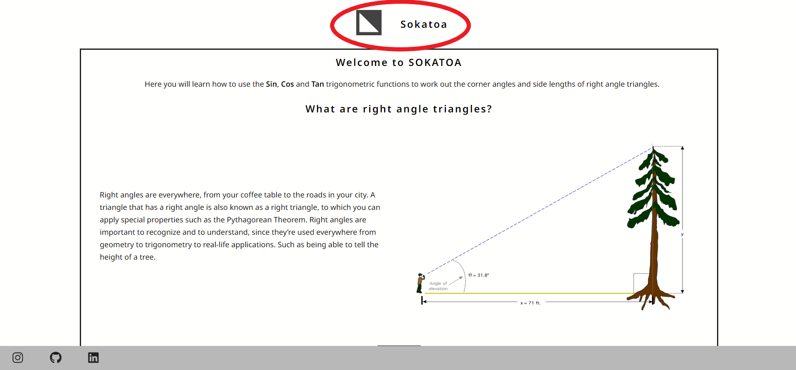
    </figure>

 

2. As a first-time user, I want to know what the purpose of the site is. 

| **Feature** | **Action** | **Expected Result** | **Result** |
| ----- | ----- | ----- | ----- |
| Learn Section | User loads the page | User is given a brief introduction to the site | Works as expected |

Screenshots

    <figure>
        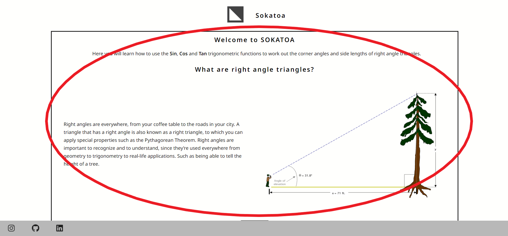
    </figure>

 

3. As a user, I want to learn the basics of trigonometric functions.

| **Feature** | **Action** | **Expected Result** | **Result** |
| ----- | ----- | ----- | ----- |

Screenshots

    <figure>
        
    </figure>
    <figure>
        
    </figure>

 

4. As a user, I want to test my knowledge of trigonometric functions.

| **Feature** | **Action** | **Expected Result** | **Result** |
| ----- | ----- | ----- | ----- |

Screenshots

    <figure>
        
    </figure>
    <figure>
        
    </figure>

 

5. As a user, I want to see how many correct/incorrect questions I've scored.

| **Feature** | **Action** | **Expected Result** | **Result** |
| ----- | ----- | ----- | ----- |

Screenshots

    <figure>
        
    </figure>
    <figure>
        
    </figure>

 

6. As a user, I want to provide feedback to the site. 
7. As the site owner, I want users to be able to find me on social media.

| **Feature** | **Action** | **Expected Result** | **Result** |
| ----- | ----- | ----- | ----- |

Screenshots

    <figure>
        
    </figure>
    <figure>
        
    </figure>

 

## Bugs
| **Bug** | **Fix** |
| ----------- | ----------- |
| Question options weren't set in a random order | Random number for option shuffler set to length of option array |
| Question asked for 'x' when 'q' is shown on image | All questions reviewed to match question to image |

 

## Deployment
### Site Deployment
The site was deployed using Github Pages using the following steps:
 1. In the github repository open repository **settings**.
 2. In setting open **pages** tab.
 3. Select branch **main** as source.
 4. **Save** selection to deploy the site.
 5. Open the deployed site using the link provided on the screen.

Steps to deploy site on Github Pages

    <figure>
        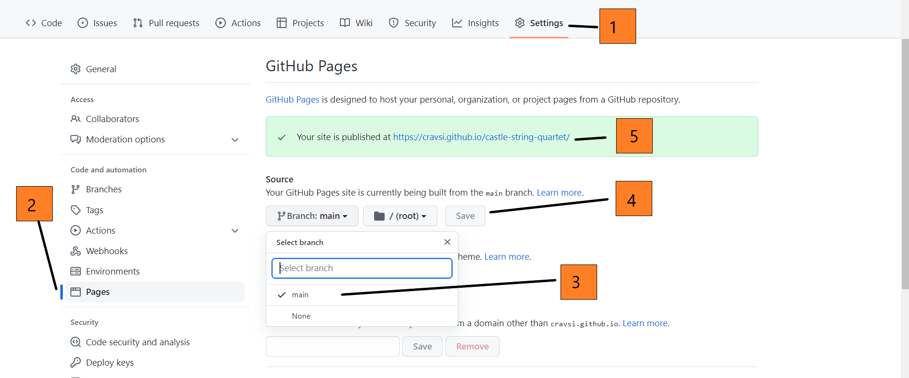
    </figure>

 

### Version Control
#### Git and Github
Repository created on Github. 
Method:
- Create new public repository on Gitpod using the CodeInstitiute template.
- Open a Gitpod workspace.
- Create required folders and documents.
- Project was previewed using the liveserver port on a the Firefox browser.
- Work was continuosly saved and committed using the following git commands:
    - **git add .** to stage changes to git.
    - **git commit -m** to commit changes
    - **git push** to push changes to Github repo.
 

#### Fork
A copy of the original repository can be created by forking it. This will allow changes to be made to the cloned repo without it affecting the original.

1. From within the repo you want to fork click the **fork** button.
2. Input the name and description of your cloned repo and click the **Create fork** button.

Steps to fork a repository

    <figure>
        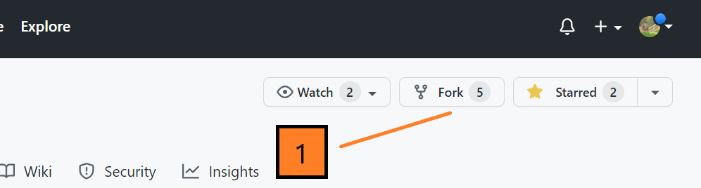
    </figure>

 

#### Clone
Cloning a repo allows you to make local changes to the repository before committing and pushing them to the remote.
z
1. From within the repo you want to clone click the dropdown **Code** button.
2. Click on the clipboard icon to copy the URL.
3. In Git Bash, navigate to the working directory you want to place the clone.
4. Type `git clone` followed by the copied URL.
5. Press `Enter` and the clone will be created. 

Steps to clone a repository

    <figure>
        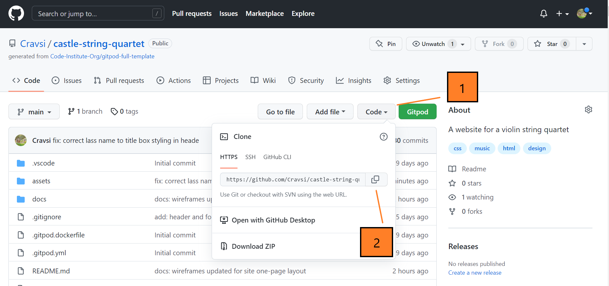
    </figure>

 

## Credits
Explanations for the Sohcahtoa memnomic were taken from <a href="https://calcworkshop.com/triangle-trig/sohcahtoa/">CalcWorkshop</a>
 

### Images
<a href="assets/images/opposite-adjacent-hypotenuse-diagram.png">Right Angle Diagram</a> taken from <a href="https://calcworkshop.com/triangle-trig/sohcahtoa/">CalcWorkshop</a>
 
<a href="assets/images/sohcahtoa-chart.png">SohCahToa Diagram</a> taken from <a href="https://calcworkshop.com/triangle-trig/sohcahtoa/">CalcWorkshop</a>
 
<a href="assets/images/questions/question2.png">Trigonometry Diagram 2</a> taken from <a href="https://mathsmadeeasy.co.uk/">MathsMadeEasy</a>
 
<a href="assets/images/questions/question3.png">Trigonometry Diagram 3</a> taken from <a href="https://mathsmadeeasy.co.uk/">MathsMadeEasy</a>
 
<a href="assets/images/questions/question4.png">Trigonometry Diagram 4</a> taken from <a href="https://mathsmadeeasy.co.uk/">MathsMadeEasy</a>
 
<a href="assets/images/questions/question5.webp">Trigonometry Diagram 5</a> taken from <a href="https://mathsmadeeasy.co.uk/">MathsMadeEasy</a>
 
<a href="assets/images/questions/question6.png">Trigonometry Diagram 6 & 7</a> taken from <a href="https://www.storyofmathematics.com/trigonometric-functions/">Story of Mathematics</a>
 
<a href="assets/images/questions/question8.png">Trigonometry Diagram 8</a> taken from <a href="https://www.basic-mathematics.com/what-is-trigonometry.html">Basic-Mathematics.com</a>
 
<a href="assets/images/questions/question9.png">Trigonometry Diagram 9</a> taken from <a href="https://www.mathsisfun.com/">mathsisfuncom</a>
 
<a href="assets/images/questions/question10.png">Trigonometry Diagram 10</a> taken from <a href="https://www.justinmath.com/trigonometric-functions/">Justin Math</a>
 

### Code
- The button hover animations for the menu buttons and logo buttons taken from <a href="https://github.com/IanLunn/Hover">Hover</a> by <a href="https://github.com/IanLunn">Ian Lunn</a> on GitHub.
 

## Acknowledgements
I would like to thank my mentor Simen Dehlin for his mentorship throughout the project. I would also like to thank Mo and Mike Sheehan, the cohort mentor and facilitator for helping out wherever I had any questions. Lastly, thanks to all my friends and family who were happy to help out with the device testing.